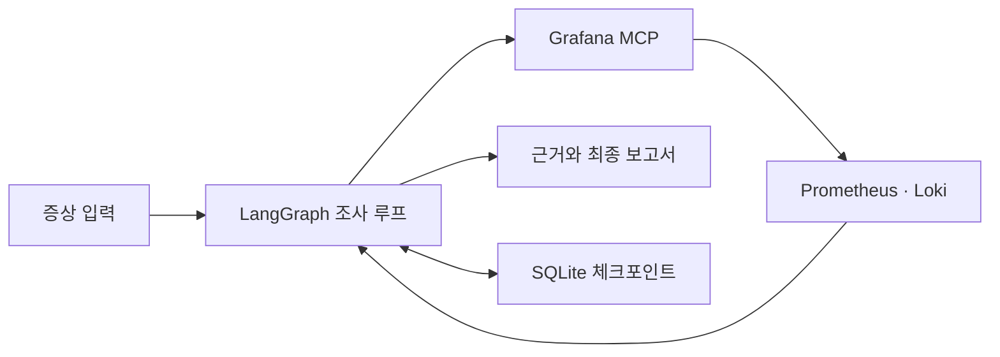

# Livith OpsAgent

**지표와 로그를 근거로 운영 문제를 조사하는 로컬 AI Agent.**

Grafana MCP로 Prometheus·Loki 데이터를 조회하고, 로컬 Ollama 모델이 다음 조사 도구를
선택합니다. 관측 사실과 모델의 가설을 구분한 보고서를 생성하고, 조사 과정은 저장해
중단 후에도 이어갈 수 있습니다.

## 주요 기능

- **도구 선택 기반 조사** — 수집한 근거에 따라 이전 구간 지표나 관련 로그를 추가 조회
- **중단·재개** — LangGraph와 SQLite 체크포인트로 조사 상태 보존
- **근거가 연결된 보고서** — 조회 조건·출처·관측값과 모델 해석을 구분해 JSON으로 출력
- **실행 추적과 평가** — Langfuse 연동 및 합성 사례 기반 고정 보고서 평가



## 시작하기

Python 3.13 이상, uv, 로컬 Ollama와 Grafana 읽기 전용 서비스 계정이 필요합니다.
기본 모델은 `qwen2.5:3b`입니다.

```bash
uv sync
```

`.env.example`을 참고해 `.env`에 Grafana URL과 토큰을 설정하고, Ollama에서 기본 모델을
준비한 뒤 실행합니다. 실행 명령은 프로젝트 루트를 기준으로 합니다.

```bash
uv run python run_agent.py --symptom "최근 외부 API 요청률과 관련 로그 확인"
```

조회 대상은 외부 API 요청률과 `livith-server` 로그이며, 기본 조회 구간은 최근 30분입니다.
시작·종료 시각을 함께 지정하면 최대 6시간의 과거 구간을 조회합니다.

```bash
uv run python run_agent.py --timezone Asia/Seoul \
  --start "2026-09-26T22:00:00" --end "2026-09-26T23:00:00" \
  --symptom "외부 API 호출량 변화 확인"
```

오프셋 없는 시각은 `--timezone`(기본 `Asia/Seoul`)으로 해석하고 UTC로 저장합니다.
오프셋이 포함된 시각은 해당 오프셋을 우선합니다. 증상 문장에서 시간·대상을 자동 추출하지 않습니다.
지원 값은 `--service livith-server`, `--investigation-type external_api`,
`--environment unspecified`입니다. 환경 필터와 지표의 서비스 필터는 적용하지 않습니다.
결과는 터미널에 JSON으로 표시하고 `artifacts/agent/<thread_id>/`에 저장합니다.

조사를 단계별로 실행하려면 다음 명령을 사용합니다. `--seconds`는 실행 시간 예산입니다.

```bash
uv run python run_agent.py --seconds 600 --step
uv run python run_agent.py --status THREAD_ID
uv run python run_agent.py --resume THREAD_ID
```

`THREAD_ID`에는 첫 실행에서 출력된 ID를 사용합니다. 중단 시간도 실행 예산에 포함됩니다.
재개·상태 확인에는 저장된 요청을 사용하므로 새 조사 옵션을 함께 지정할 수 없습니다.
상태 v2의 기존 조사는 재개할 수 없으며, 저장된 결과 파일은 유지됩니다.
Agent CLI는 macOS/Linux를 지원합니다.

## 고정 수집과 평가

정해진 순서로 지표·로그를 수집하고 보고서를 생성하는 실행 방식도 제공합니다.

```bash
uv run python run_investigation.py
uv run python evaluate_reports.py --prompt-versions ops_report_v3
```

모델의 가설은 검토가 필요한 분석 초안입니다. 관측값 검증과 모델 해석의 정확도는
구분해서 평가합니다. [평가 방법과 결과](evals/README.md)에서 자세히 확인할 수 있습니다.

## 구성

| 디렉터리 | 역할 |
|---|---|
| `ops_agent/agent` | 조사 상태, 도구 선택, 실행 흐름과 예산 |
| `ops_agent/collectors`, `ops_agent/tools` | Grafana 연결, 응답 파싱과 조사 도구 |
| `ops_agent/persistence` | 체크포인트와 근거 파일 저장 |
| `ops_agent/reporting` | 보고서 구성과 관측값 검증 |
| `ops_agent/telemetry` | Langfuse 실행 추적 |
| `prompts`, `evals`, `tests` | 프롬프트, 평가 사례와 테스트 |

[조사 구조](docs/architecture/agent-workflow.md) · [Langfuse 설정](docs/setup/langfuse.md) · [문서 목록](docs/README.md)

## 테스트

```bash
uv run pytest -q
uv run ruff check .
```

테스트는 합성 응답을 사용하며 실제 Grafana·Ollama 호출과 Langfuse 전송 없이 실행합니다.
