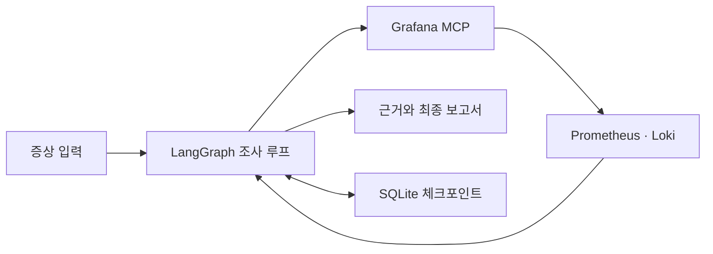

# Livith OpsAgent

**지표와 로그를 근거로 운영 문제를 조사하는 로컬 AI Agent.**

Grafana MCP로 Prometheus·Loki 데이터를 조회하고, 로컬 Ollama 모델이 다음 조사 도구를
선택합니다. 관측 사실과 조사 판단을 구분한 보고서를 생성하고, 조사 과정은 저장해
중단 후에도 이어갈 수 있습니다.

## 주요 기능

- **HTTP 후속 조사 선택** — 관측된 엔드포인트·지표·비교 구간을 모델이 선택하고 가설 갱신
- **중단·재개** — LangGraph와 SQLite 체크포인트로 조사 상태 보존
- **근거가 연결된 보고서** — 조회 조건·출처·관측값과 모델 해석을 구분해 JSON으로 출력
- **실행 추적과 평가** — Langfuse 연동 및 합성 사례 기반 고정 보고서 평가



## 시작하기

Python 3.13 이상, uv, 로컬 Ollama와 Grafana 읽기 전용 서비스 계정이 필요합니다.
기본 모델은 `qwen2.5:3b`입니다.

```bash
uv sync
```

`.env.example`을 참고해 `.env`에 Grafana URL과 토큰을 설정하고, Ollama에서 기본 모델을
준비한 뒤 실행합니다. 실행 명령은 프로젝트 루트를 기준으로 합니다.

```bash
uv run python -m ops_agent.cli.run_agent --symptom "최근 외부 API 요청률과 관련 로그 확인"
```

조회 대상은 외부 API 요청률과 `livith-server` 로그이며, 기본 조회 구간은 최근 30분입니다.
시작·종료 시각을 함께 지정하면 최대 6시간의 과거 구간을 조회합니다.
기본 필수 조회는 현재·직전 지표와 서비스 로그입니다. 비교가 필요 없으면
`--no-compare-previous`를 사용합니다. 필수 조회가 남으면 완료 처리하지 않습니다.

```bash
uv run python -m ops_agent.cli.run_agent --timezone Asia/Seoul \
  --start "2026-09-26T22:00:00" --end "2026-09-26T23:00:00" \
  --symptom "외부 API 호출량 변화 확인"
```

오프셋 없는 시각은 `--timezone`(기본 `Asia/Seoul`)으로 해석하고 UTC로 저장합니다.
오프셋이 포함된 시각은 해당 오프셋을 우선합니다. 증상 문장에서 시간·대상을 자동 추출하지 않습니다.
지원 값은 `--service livith-server`, `--investigation-type external_api`,
`--environment unspecified`입니다. 환경 필터와 지표의 서비스 필터는 적용하지 않습니다.
결과는 터미널에 JSON으로 표시하고 `artifacts/agent/<thread_id>/`에 저장합니다.

조사를 단계별로 실행하려면 다음 명령을 사용합니다. `--seconds`는 실행 시간 예산입니다.

```bash
uv run python -m ops_agent.cli.run_agent --seconds 600 --step
uv run python -m ops_agent.cli.run_agent --status THREAD_ID
uv run python -m ops_agent.cli.run_agent --resume THREAD_ID
```

`THREAD_ID`에는 첫 실행에서 출력된 ID를 사용합니다. 중단 시간도 실행 예산에 포함됩니다.
재개·상태 확인에는 저장된 요청을 사용하므로 새 조사 옵션을 함께 지정할 수 없습니다.
새 조사는 상태 v4입니다. 상태 v2·v3의 기존 조사는 재개할 수 없으며, 저장된 결과 파일은 유지됩니다.
Agent CLI는 macOS/Linux를 지원합니다.

## HTTP 조사 에이전트

HTTP 요청률과 평균 지연을 먼저 수집한 다음, 모델이 **어느 엔드포인트를 어떤 구간에서
더 조사할지 또는 종료할지** 선택합니다. 직전 구간 비교와 현재 구간의 앞·뒤 절반 조회는
선택 사항입니다. 가설에는 근거 ID를 인용하고, 후속 관측에 따라 가설 상태를 갱신합니다.

```bash
uv run python -m ops_agent.cli.run_http_agent \
  --symptom '/api/v7/recommendation//concerts 평균 지연이 직전 구간보다 증가했는지 확인'

# 같은 관측·도구·예산으로 규칙 기준선 실행
uv run python -m ops_agent.cli.run_http_agent --planner rules

# 조회 하나 후 중단하고 이어서 실행
uv run python -m ops_agent.cli.run_http_agent --step
uv run python -m ops_agent.cli.run_http_agent --resume THREAD_ID

# 합성 데이터로 규칙과 실제 로컬 모델 비교 (Grafana 연결 없음)
uv run python -m ops_agent.cli.evaluate_http_agent --planner both
```

`--start`, `--end`, `--timezone`, `--route`, `--method`는 아래 HTTP 도구와 같습니다.
기본 실행 예산은 180초, 조회 6회(초기 2회 포함)이며 `--seconds`, `--tool-calls`로 조절합니다.
모델은 `--model`로 지정하며 기본값은 `qwen2.5:3b`입니다. HTTP 조사의 `--step` 중단 시간은
실행 시간에서 제외합니다. 실행·재개 한 번에 MCP 세션 하나를 공유합니다.

결과는 `artifacts/http-agent/<thread_id>/report.json`입니다. `facts`는 파싱된 관측,
`decisions`는 선택 이력, `interpretation.hypotheses`는 최종 가설입니다. 가설의
`supported`·`rejected`도 모델 해석이며, 인용한 근거가 존재하는지와 문장 내용이 맞는지는
다른 검사입니다. 예산 종료로 마지막 관측을 검토하지 못했다면 `unreviewed_evidence_ids`에 남깁니다.

현재 후보는 초기 관측 중 최대 평균 지연이 높은 **상위 12개 엔드포인트**로 제한됩니다.
특정 대상은 `--route`로 범위를 좁힐 수 있습니다. 모델이 고르는 값은 이 후보·두 지표·세 구간
안에서만 허용하며 임의 PromQL은 실행하지 않습니다. 10분 미만 구간에는 절반 조회를 제공하지 않습니다.
규칙 기준선은 최대 평균 지연이 가장 큰 엔드포인트의 직전 지연·요청률을 조회한 뒤 종료합니다.
합성 평가는 대상 선택과 양쪽 근거 인용을 측정하는 개발용 4개 사례이며, 가설 의미 검토는 별도입니다.
현재 3B 모델은 비교가 필요한 3개 사례에서 모두 필요한 직전 구간 조회를 놓쳤습니다.
이 기능은 판단 품질을 검증 중인 실험 단계입니다. [실행 결과와 실패 분석](evals/results/agent/http-agent-validation.md)을 참고하세요.

### HTTP 도구 직접 실행

HTTP 도구를 직접 실행하려면 다음 명령을 사용합니다. 기본값은 최근 30분의 전체
메서드·엔드포인트이며, 요청률과 평균 지연을 하나의 읽기 전용 MCP 세션에서 조회합니다.

```bash
uv run python -m ops_agent.cli.query_http

# 특정 엔드포인트의 평균 지연 조회
uv run python -m ops_agent.cli.query_http \
  --metric http_mean_latency --method GET \
  --route '/api/v7/recommendation//concerts' \
  --start '2026-09-26T21:00:00' --end '2026-09-27T21:00:00' \
  --timezone Asia/Seoul
```

`--metric`은 `all`(기본), `http_request_rate`, `http_mean_latency` 중 하나입니다.
`--start`·`--end`는 함께 지정하며 최대 24시간을 지원합니다. 직전 구간 비교는 시작·종료를
이전 구간으로 지정해 별도로 조회합니다. `--seconds`는 연결을 포함한 실행 예산으로 기본 90초입니다.
HTTP 대상은 `ops_agent/config.py`의 `HTTP_DATASOURCE_UID`, `HTTP_JOB`에 있으며,
현재 `grafanacloud-prom`, `livith-server-production`을 사용합니다.
`route`는 실제 라벨에 정확히 매칭하며 `//`, `:id`를 바꾸지 않습니다.

요청률은 **req/s**, 평균 지연은 최근 5분의 지연 합계 증가율을 관측 건수 증가율로 나눈
**ms**입니다. 인스턴스별 합계를 먼저 더한 뒤 나누며 p95·p99는 계산하지 않습니다.
요청이 없는 구간의 지연은 값이 빠질 수 있으며, 빈 결과를 0이나 정상으로 처리하지 않습니다.
조회 평가 간격은 60초이고 `sample_count`는 요청 건수가 아닌 평가 시점 수입니다.

원본·요약·조회 조건·단위·예산은 `artifacts/http/<run_id>/`에 저장됩니다. 공통 실행기는
도구와 최종 인자의 해시로 캐시를 구분하며, 같은 조사에서 조건이 달라지면 별도 근거로 저장합니다.
각 CLI 실행은 새 조사 디렉터리를 만듭니다. 이 명령은 HTTP 수집 도구 확인용으로 모델을 호출하지
않습니다. HTTP 조사 루프는 `run_http_agent`, 기존 외부 API 조사 경로는 `run_agent`로 실행합니다.

## 고정 수집과 평가

정해진 순서로 지표·로그를 수집하고 보고서를 생성하는 실행 방식도 제공합니다.

```bash
uv run python -m ops_agent.cli.run_investigation
uv run python -m ops_agent.cli.evaluate_reports --prompt-versions ops_report_v3

# 합성 관측과 실제 로컬 모델로 Agent 전체 루프 평가
uv run python -m ops_agent.cli.evaluate_agent
```

기존 외부 API Agent는 반환 로그의 경고·오류 레벨과 동일 API의 구간 마지막 요청률 증가를 코드로
검증합니다. 모델은 조회·관측 선택만 맡고, 설명·한계·다음 확인 항목은 코드가 작성합니다.
이 경로에서는 서비스 정상·장애 판정과 원인 가설 생성을 지원하지 않습니다.
서비스 로그가 한도 미만이고 잘리지 않았다고 명시된 경우에는 같은 범위의 경고 문자열
추가 조회를 생략합니다. 잘림이나 완전성 정보 누락이 있으면 추가 조회를 허용하고,
그 판단 근거와 실제 조회 여부를 보고서의 `warning_log_followup`에 기록합니다.

고정 보고서 경로의 모델 가설은 별도 검토가 필요한 분석 초안입니다. Agent의 조회 선택과
코드 설명 정책도 구분해서 평가합니다. [평가 방법과 결과](evals/README.md)에서 자세히 확인할 수 있습니다.

## 구성

| 디렉터리 | 역할 |
|---|---|
| `ops_agent/cli` | 조사 실행, 합성 평가와 Langfuse 연결 진단 CLI |
| `ops_agent/agent` | 조사 상태, 실행 흐름, 관측 정책과 예산 |
| `ops_agent/agent/decision` | 모델의 도구 선택, 응답 검증과 이전 버전 호환 |
| `ops_agent/collectors`, `ops_agent/tools` | Grafana 연결, 응답 파싱과 조사 도구 |
| `ops_agent/persistence` | 체크포인트와 근거 파일 저장 |
| `ops_agent/reporting` | 보고서 구성과 관측값 검증 |
| `ops_agent/telemetry` | Langfuse 실행 추적 |
| `ops_agent/evaluation` | Agent 전체 루프와 고정 보고서 평가 로직 |
| `prompts/agent`, `prompts/report` | Agent와 보고서의 버전별 프롬프트 |
| `evals/datasets`, `evals/results` | 합성 평가 데이터셋과 저장소에서 관리하는 검증 문서 |
| `tests` | 운영 코드의 역할별 테스트와 공통 도우미 |

조사 실행·평가·연결 진단 CLI는 `ops_agent/cli/`에 모여 있으며 프로젝트 루트에서
`uv run python -m ops_agent.cli.<명령>`으로 실행합니다. 기존 `python <명령>.py` 대신
모듈 실행 방식을 사용합니다. 평가 데이터와 검증 문서는 각각 `agent/`, `report/`로
구분하며, 실행 중 생성되는 파일은 `artifacts/evaluations/`에 저장합니다.

[조사 구조](docs/architecture/agent-workflow.md) · [Langfuse 설정](docs/setup/langfuse.md) · [문서 목록](docs/README.md)

## 테스트

```bash
uv run pytest -q
uv run ruff check .
uv run ruff format --check .
```

테스트는 합성 응답을 사용하며 실제 Grafana·Ollama 호출과 Langfuse 전송 없이 실행합니다.
`tests/agent`, `collectors`, `tools`, `persistence`, `reporting`, `telemetry`,
`evaluation`, `integration`으로 검사 대상을 구분합니다. 공통 fixture는
`tests/conftest.py`, 재사용하는 합성 응답과 모델 도우미는 `tests/helpers/`에 있습니다.
