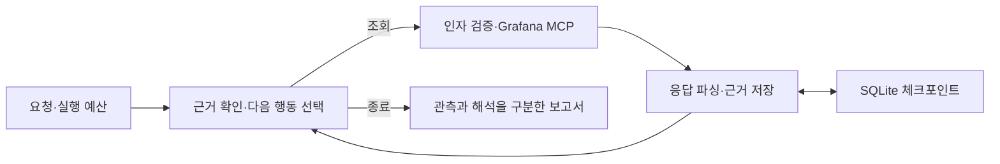

# 조사 구조

[프로젝트 소개](../../README.md) · [실행 안내](../usage.md) · [평가](../../evals/README.md)

OpsAgent는 Grafana의 읽기 전용 도구로 관측을 수집하고 로컬 Ollama 모델로 조사 선택을
생성합니다. LangGraph가 실행 흐름을 관리하고 SQLite가 같은 조사의 중단·재개를 지원합니다.

## 모델과 코드의 역할

| 경로 | 코드가 맡는 일 | 모델이 맡는 일 |
|---|---|---|
| 외부 API | 필수 조회 이행, 관측 계산, 보고서 설명 | 허용된 조회·관측 ID 선택 |
| HTTP | 초기 두 지표 수집, 후보 생성, 실행 검증 | 후속 조회 조건, 가설과 종료 선택 |
| 고정 보고서 | 지표→로그 수집, 관측값 대조 | 구조화된 보고서 초안 생성 |

### 외부 API

현재·직전 외부 API 요청률과 서비스 로그를 기본 필수 항목으로 저장합니다.
직전 비교는 명시적 요청 옵션으로 제외할 수 있습니다. 필수 조회가 남으면 완료를 차단합니다.

코드가 계산하는 관측은 반환 로그의 경고·오류 레벨과 동일 API의 두 구간 마지막 요청률 증가입니다.
문자열 매칭만으로 로그 레벨을 정하지 않으며, 중복 라벨·잘못된 수치·오래된 샘플은 비교에서 제외합니다.
모델의 `claim_ids` 선택과 별도로 검증된 관측 전체를 보고서에 보존합니다.

추가 `warning_logs`는 같은 범위의 서비스 로그가 성공적으로 반환되고 100건 미만이며
잘림·한도 도달·잘림 가능성 플래그가 모두 false일 때 후보에서 제외합니다. 완전성 정보가
누락되거나 잘린 경우에는 허용합니다. 정책은 입력·스키마·출력 검증·호출 직전 검사에서 공유하며,
보고서의 `warning_log_followup`에 적격 여부와 실제 조회 여부를 기록합니다.

보고서 v4의 설명은 코드가 작성합니다. `required_checks`에는 필수 조회 이행을,
`verified_claims`에는 관측을 기록하고 `health_assessment`는 `not_evaluated`로 둡니다.

### HTTP

초기 요청률·평균 지연을 수집한 뒤 최대 평균 지연이 높은 상위 12개 엔드포인트를 후보로 만듭니다.
모델은 엔드포인트·지표·구간 조합 또는 종료를 선택합니다. 후속 구간은 같은 길이의 직전 구간과
현재 구간의 앞·뒤 절반이며, 10분 미만 구간에는 절반 조회를 제공하지 않습니다.

`HTTPDecision`은 조회 조건·이유·근거 ID를 인용한 가설을 담습니다. `investigation_update`는
직전 판단 이후의 근거와 조회 목적, 당시 가설을 함께 보여줍니다. 결과 연결은 조회 조건 해시로
확인하며, 저장된 이력에서 계산하므로 재개 후에도 유지됩니다. 전체 관측·판단 이력도 전달합니다.

가설은 `unverified`, `supported`, `rejected`, `insufficient_evidence` 상태를 가집니다.
코드는 스키마·후보·근거 ID를 검증하고 가설 내용은 별도 평가합니다. 보고서의 `facts`와
`interpretation`을 분리하며, 마지막 판단 이후 들어온 근거를 `unreviewed_evidence_ids`에 남깁니다.

planner와 수집기는 주입할 수 있어 규칙 기준선과 모델을 같은 실행 경로로 비교합니다.
규칙 기준선은 최대 평균 지연이 가장 큰 엔드포인트의 직전 지연·요청률을 조회하고 종료합니다.

## 도구 실행과 저장

`tools/http.py`의 도구 정의는 지표 설명·단위·PromQL 템플릿을 제공합니다.
`HTTPQuery`는 지표·시간·route·method를 검증합니다. 데이터소스와 job은 설정에서 가져오며
모델이 임의 PromQL을 실행하거나 조회 범위를 넓힐 수 없습니다.

외부 API와 HTTP는 `tools/grafana.py`의 실행기를 공유합니다. 도구와 최종 인자의 해시로
캐시를 구분하고 예산 차감·응답 보존·파싱·오류 기록을 처리합니다. HTTP는 실행·재개 한 번에
MCP 세션 하나를 공유합니다. 파일은 원자적으로 저장하고 CLI의 파일 잠금으로 동시 실행을 제한합니다.

잘못된 모델 응답은 원문을 보존한 뒤 같은 예산 안에서 한 번 수정합니다.
시간 초과·통신 오류·출력 잘림은 자동 수정하지 않습니다. 수집 실패나 예산 소진은 `incomplete`로 남깁니다.
빈 데이터는 `no_data`이며 유효한 수치 0과 구분합니다.

| 저장 위치 | 내용 |
|---|---|
| `artifacts/agent/checkpoints.sqlite` | 외부 API 체크포인트 |
| `artifacts/agent/<thread_id>/` | 외부 API 근거·판단·예산·보고서 |
| `artifacts/http-agent/<thread_id>/` | HTTP 체크포인트·근거·판단·예산·보고서 |
| `artifacts/http/<run_id>/` | 모델 없는 HTTP 도구 실행 결과 |
| `artifacts/evaluations/` | 합성 평가 입력·응답·집계 |

## 예산과 재개

| 항목 | 외부 API | HTTP |
|---|---|---|
| 상태 계약 | v4 | `http-agent-v1` |
| 기본 실행 시간 | 90초 | 180초 |
| 기본 도구 / 모델 호출 상한 | 6 / 6 | 6 / 8 |
| 기본 모델 호출당 시간 | 45초 | 45초, `--llm-seconds`로 설정 |
| 정상 중단 시간 | 실행 예산에 포함 | 실행 예산에서 제외 |

HTTP 근거·판단은 append reducer로 누적하고 남은 실행 시간은 그래프 상태에 저장합니다.
노드 실행과 MCP 연결 시간을 차감합니다. 소비한 호출·예약 토큰은 파일 장부에 즉시 기록합니다.
모델 호출당 예약 토큰은 17,408이며 수신한 실제 사용량과 구분합니다.
HTTP의 직렬화 입력 상한 24,000바이트는 토큰 수와 별도의 제한입니다.

재개는 저장된 요청·프롬프트·예산으로 같은 조사를 이어갑니다. 현재 코드의 실행 정책을 적용하며,
지원하지 않는 상태 버전은 거부합니다. 체크포인트 되감기·분기는 지원하지 않습니다.
강제 종료된 HTTP 노드의 미완료 실행 시간은 복원되지 않을 수 있습니다.

## 관측과 평가

외부 API·고정 보고서는 [Langfuse](../setup/langfuse.md)에 추적을 연결할 수 있습니다.
HTTP는 조회 원문·모델 응답·시간·사용량을 로컬에 기록합니다.
모델의 선택·해석과 실행 제어는 [별도 평가 항목](../../evals/README.md)으로 확인합니다.
