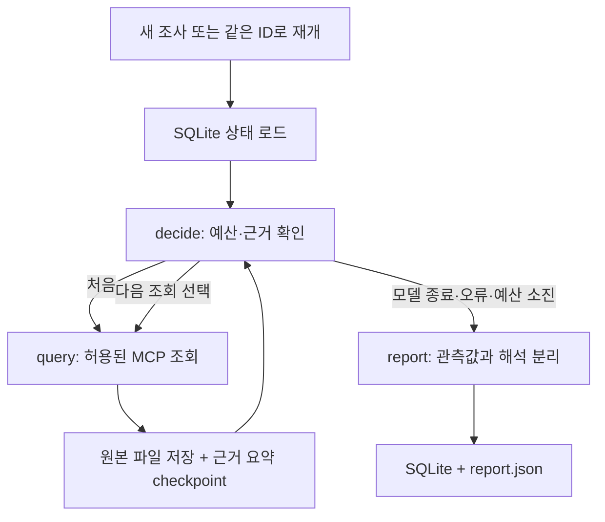

# OpsAgent 조사 흐름

[문서 목록](../README.md) · [프로젝트 사용법](../../README.md)

## 두 실행 방식

- `run_investigation.py`: 현재 구간 지표 → 로그 → v3 보고서의 고정 비교 기준선.
- `run_agent.py`: 현재 지표 수집 후 모델이 허용된 다음 조회를 선택하는 제한된 조사 루프.

두 방식은 보고서 형식이 다릅니다. 기존 `evaluate_reports.py`는 고정 보고서용입니다.
Agent 판단 품질을 같은 데이터셋으로 비교하는 어댑터는 아직 구현하지 않았습니다.

## 파일별 역할

| 위치 | 역할 |
|---|---|
| `run_agent.py` | CLI 인자, 동시 실행 잠금 |
| `ops_agent/config.py` | 프로젝트·프롬프트·상태 DB 경로 |
| `ops_agent/persistence/session.py` | 조사 시작·재개, SQLite 연결, 실행별 Langfuse trace |
| `ops_agent/agent/state.py` | graph 상태와 모델 출력 스키마 |
| `ops_agent/agent/graph.py` | 노드와 조건 분기 연결 |
| `ops_agent/agent/nodes.py` | 상태 확인, 도구·모델 호출, 종료 사유 |
| `ops_agent/agent/planner.py` | 요약 기반 도구 선택, JSON·근거 ID 검증 |
| `ops_agent/agent/budget.py` | 영속적인 호출·예약 토큰 예산과 시간 확인 |
| `ops_agent/tools/grafana.py` | 고정 쿼리 목록, 읽기 전용 MCP 호출 |
| `ops_agent/collectors/` | 기존 조회 CLI, MCP 설정, 응답 파서 |
| `ops_agent/persistence/artifacts.py` | JSON의 원자적 교체, 조회 결과 재사용 |
| `ops_agent/reporting/agent_report.py` | 관측 사실과 모델 해석을 분리한 최종 결과 |
| `ops_agent/telemetry/langfuse.py` | 기존 보고서와 Agent가 공유하는 Langfuse 기록 |

`tools`는 운영 중인 Livith를 조사하고, `telemetry`는 OpsAgent 자신의 실행을 기록합니다.
최상위 Python 파일은 사용자 실행 진입점으로 유지합니다. 패키지 내부에서 최상위
`observability.py`를 import하는 의존성은 제거했습니다.

## 실행 순서



1. 새 조사에서 현재 UTC 시각을 기준으로 30분 범위, 프롬프트 원문·해시와 마감 시각을 고정합니다.
2. 첫 조회는 `current_metrics`입니다. 임의의 도구나 쿼리는 실행하지 않습니다.
3. 모델에는 증상, 쿼리·시간·요약·근거 ID와 선택 가능한 도구를 제공합니다. 원본 로그는 제외합니다.
4. 출력 스키마에서도 이미 사용한 도구를 제외하고 응답의 중복 선택과 근거 ID를 다시 검증합니다.
5. 선택된 도구를 실행하고 원본은 파일, 요약은 상태에 저장합니다.
6. 종료하면 관측값은 파싱 결과에서 직접 보고서에 넣고 가설·판단은 모델 결과로 구분합니다.

## 추가 조사와 종료 판단

예산이 남았다는 사실만으로 조회하지 않습니다. 첫 지표 조회 뒤 모델에 증상, 조회 구간,
관측 요약, 이전 선택, 아직 사용하지 않은 도구와 남은 시간을 전달합니다. 모델은 다음
도구 또는 `finish`를 JSON으로 선택하고 `rationale`에 그 이유를 작성합니다. 프롬프트는
추가 조회가 어떤 정보를 더하는지 설명하고, 얻을 정보가 없거나 도구 범위 밖이면 종료하도록 지시합니다.

코드는 허용 도구·중복 여부·출력 형식·가설의 근거 ID를 검사합니다. 추가 조회의 유용성이나
종료 이유가 타당한지 의미적으로 검증하는 규칙은 아직 없습니다. 모델이 너무 일찍 종료하거나
필요 없는 조회를 고를 수 있습니다. 예를 들어 이전 구간 비교는 변화 여부를 확인할 수 있지만,
요청률만으로 지연 문제의 원인을 판단할 수는 없습니다.

종료는 두 가지로 나뉩니다.

- 모델이 `finish` 선택: `completed` / `model_finished`. 답을 얻었다는 보장은 아닙니다.
- 시간·호출·컨텍스트 제한, 수집·모델 오류: `incomplete`와 해당 종료 사유를 저장합니다.

도구 호출 한도에 도달하면 추가 도구를 제거하고, 모델 예산이 남아 있으면 종료 판단을 요청합니다.
사용 가능한 도구를 모두 썼을 때도 `finish`만 허용합니다. 보고서 단계의 최소 관측 범위 검사는
결론을 `insufficient_evidence`로 낮출 수 있지만, 누락된 로그를 자동으로 추가 조회하지는 않습니다.
`assessment: needs_investigation`은 후속 확인이 필요하다는 보고서 분류이며 루프를 계속하는 명령이 아닙니다.

후속 개선은 요청 유형별 필수 근거, 미해결 질문, 추가 도구가 채울 수 있는 정보,
조기 종료·불필요한 조회 평가를 함께 정의하는 것입니다. 모든 도구를 무조건 호출하는 규칙은 아닙니다.

## 최근 30분을 사용하는 이유와 한계

현재 구현의 고정 기준선입니다. 조회량과 모델 입력 크기를 제한하고 지표·로그를 같은
구간에서 비교하기 위한 초기 선택이며, 장애 분석의 표준 구간이나 검증된 최적값이 아닙니다.
현재 쿼리에는 5분 rate 계산과 60초 평가 간격을 사용합니다. 조사 구간 30분, rate 계산 5분,
실행 예산 90초는 각각 다른 설정입니다.

새 조사에서 UTC 시작·종료를 한 번 계산해 상태에 보관하고 재개 시 그대로 사용합니다.
진행 중인 조사에서 구간이 계속 움직이면 서로 다른 시각의 근거를 같은 조사로 비교할 수 있기 때문입니다.
증상에 "어제 22시"를 적어도 실제 조회는 최근 30분이며, `--seconds`로는 이를 바꿀 수 없습니다.

향후 서비스·환경·시간대·시작·종료를 명시적으로 입력받고 자연어에서 추출한 값도 검증해야 합니다.
기본값은 시간 미지정 시에만 적용하고 실제 조사 구간을 사용자에게 보여줘야 합니다.
사용자 지정 구간으로 확장할 때 이전 구간 비교의 길이와 쿼리 간격도 함께 조정해야 합니다.

## 현재 도구 범위

- `current_metrics`: 현재 30분의 외부 API별 초당 요청률.
- `previous_metrics`: 바로 직전 30분의 같은 지표. 두 구간은 인접하며 range 조회의 경계 평가 시각을 공유할 수 있습니다.
- `logs`: 현재 구간 서비스 로그 최대 100건의 요약.
- `warning_logs`: 같은 구간에서 `warn/error` 문자열에 매칭되는 로그 최대 100건.

경고 키워드 검색은 로그 레벨 필터가 아닙니다. 조회 결과가 겹칠 수 있으므로 로그 수를
더하지 않습니다. 빈 결과는 서비스 정상 근거가 아닙니다. 현재 쿼리는 환경 필터가 없고
HTTP 지연·오류율, CPU, DB 지표를 포함하지 않습니다. 그런 지표와 코드 조회 도구는 후속 확장입니다.

## 예산과 중단·복구

아래 숫자는 초기 구현의 제한값입니다. 장애 사례별 정확도·실행 시간·토큰 사용을 측정해서
도출한 최적값이나 SLO가 아닙니다. 조회와 모델 응답이 오래 걸리거나 반복되는 실행을 제한합니다.

- 기본 90초, 도구 호출 6회, 모델 호출 6회.
- 모델 호출 전에 17,408 예약 토큰을 확보하고 누적 110,000을 넘으면 중단합니다.
- 예약 토큰은 보수적인 사용 제한이며 정확한 비용 상한이나 실제 사용량이 아닙니다.
  실제 토큰은 `decision-*.json`의 `usage`에 기록합니다. 실패한 호출은 예약량을 환불하지 않습니다.
- 조회 한 번은 최대 20초, 모델 호출은 최대 45초이며 남은 전체 시간이 더 짧으면 그 시간을 적용합니다.
- 중단 시간도 전체 예산에 포함합니다. 디스크 저장·MCP 종료 정리·Langfuse flush 때문에
  프로세스 종료 시각까지 엄격히 90초로 제한되는 것은 아닙니다.
- SQLite에는 완료된 노드 상태를 동기적으로 저장합니다. `--step`은 조회 노드 뒤에 멈춥니다.
- 조회 결과를 파일에 저장한 뒤 checkpoint 전에 종료되어도 같은 조건의 파일을 재사용합니다.
- 호출 도중 종료되면 해당 호출은 다시 실행될 수 있습니다. 호출 전에 예산을 기록하므로
  재시작으로 한도가 초기화되지 않습니다. 이 구조는 읽기 전용이며 exactly-once 실행을 보장하지 않습니다.
- 완료된 조사를 같은 ID로 재개하면 저장 결과만 출력합니다. 새 시간대는 새 조사를 시작해야 합니다.

현재 도구는 4개이고 완료된 조회를 반복하지 않으므로 오류 없는 한 번의 조사에서는 최대 4개를
조회합니다. 도구·모델 6회는 이보다 여유를 둔 상한이며, 중단 후 재시도도 예산을 사용합니다.
예약량 17,408은 `NUM_CTX=16,384`와 `NUM_PREDICT=1,024`를 더한 보수적인 계산입니다.
이는 Ollama의 정확한 입력·출력 토큰 회계 방식이나 비용 상한을 뜻하지 않습니다.
6회 예약은 104,448이므로 현재 110,000 제한은 모델 6회 제한보다 먼저 걸리지 않습니다.
한도끼리 일부 중복되며 도구 확장 시 재조정할 필요가 있습니다.

전체 90초는 모든 도구와 모델 호출을 각 최대 시간만큼 실행할 수 있다는 보장이 아닙니다.
실제 운영값은 사례별 성공률, 불필요한 조회 비율, p95 지연, 실제 토큰을 측정한 뒤 정해야 합니다.

## SQLite와 단기·장기 메모리

SQLite는 로컬 파일 기반 DB이고 `AsyncSqliteSaver`가 조사 ID별 graph 상태·다음 실행 위치를
저장하는 데 사용합니다. 상태에는 질문, 고정 시간 구간, 근거 요약, 모델 선택 이력 등이 들어갑니다.
원본 응답·모델 호출 기록·별도 예산 장부는 조사 폴더의 JSON에 저장합니다. DB가 이 파일을 대신하지는 않습니다.

같은 조사의 이전 결과를 다음 판단에 사용하는 점에서 현재 체크포인트는 단기 메모리의 기반입니다.
아직 `messages` 기반 후속 대화 입력은 없으며 `--resume`는 기존 조사를 이어가는 기능입니다.
장기 메모리는 여러 조사에서 검증된 장애 사례·해결법을 선별해 저장하고 새 조사에서 검색하는 별도 기능입니다.
오래 보관된 체크포인트가 자동으로 장기 메모리가 되지는 않습니다. 미검증 가설을 확정 원인으로 저장하면 안 됩니다.

단기·장기를 나누는 기준은 SQLite인지 벡터 DB인지가 아니라 사용 범위와 검색 방식입니다.
장기 메모리도 작은 규모에서는 SQLite로 구현할 수 있지만, 현재 코드에는 조사 간 검색·검증·갱신 정책이 없습니다.
[LangGraph 메모리 개념](https://docs.langchain.com/oss/python/concepts/memory)을 참고하세요.

## Sentry 확장 후보

현재 Sentry 연동은 없습니다. Sentry가 실제 애플리케이션 오류를 수집하고 있다면, 같은 서비스·환경·시간의
이슈를 조회하고 이벤트의 stack trace·breadcrumbs·태그를 확인하는 기능이 다음 조사 근거가 될 수 있습니다.
trace ID가 연결돼 있고 tracing이 수집된다면 요청의 span·오류를 함께 확인할 수 있습니다.
시간이 비슷하다는 이유만으로 동일 장애라고 단정하지 않고 release·환경·request/trace ID를 함께 대조해야 합니다.

처음에는 읽기 전용 이슈 검색과 이벤트 상세 조회로 시작하고, 지표·로그만 쓸 때보다 원인 후보와
다음 조사 위치가 정확해지는지 평가합니다. 전송 범위와 민감한 이벤트 필드는 도구 출력 계약에서 정합니다.
현재의 최소 근거 검사는 Grafana 지표·로그에 묶여 있으므로 새 도구를 추가할 때 보고서 정책도 함께 바꿔야 합니다.
[Sentry 이슈 이벤트 API](https://docs.sentry.io/api/events/retrieve-an-issue-event/),
[trace 조회 API](https://docs.sentry.io/api/discover/retrieve-a-trace/)를 참고하세요.

## 결과와 Langfuse

`artifacts/agent/<thread_id>/`에는 조회별 원본, `budget.json`, `decision-*.json`,
실행별 `invocation-*.json`, 최종 `report.json`이 저장됩니다.

`facts`는 관측값과 출처입니다. `model_assessment`는 모델 판단이며 최소 지표·로그 범위가
부족하면 최종 `assessment`는 `insufficient_evidence`로 낮춥니다. 가설의 근거 ID가 유효하다는
검사는 그 가설이 사실이라는 검증이 아닙니다. 보고서에는 `semantic_review: pending`을 남깁니다.

Langfuse를 켜면 실행·재개별 `ops-agent` trace 아래에 조회 도구와 `ollama-planner`가 기록됩니다.
같은 조사 ID를 metadata에 넣어 연결하며, 재개마다 새로운 실행 ID를 사용합니다.
조회 요약·프롬프트·모델 응답은 전송되지만 원본 로그와 로컬 근거 경로는 전송하지 않습니다.
`flush_attempted`는 서버 수신 확인을 의미하지 않습니다.

## 로컬 검증

```bash
uv run pytest -q
uv run ruff check .
uv run python run_agent.py --seconds 600 --step
uv run python run_agent.py --status THREAD_ID
uv run python run_agent.py --resume THREAD_ID
```

`--status`는 저장 상태만 조회합니다. 외부 전송 없이 통합 점검하려면 실행 환경에
`OPS_LANGFUSE_ENABLED=false`를 지정합니다. `.env` 자체를 수정할 필요는 없습니다.

작성 중이던 최상위 `agent_runtime.py` 초안은
`artifacts/migration-drafts/agent_runtime-original.py.txt`에 보관했습니다.
