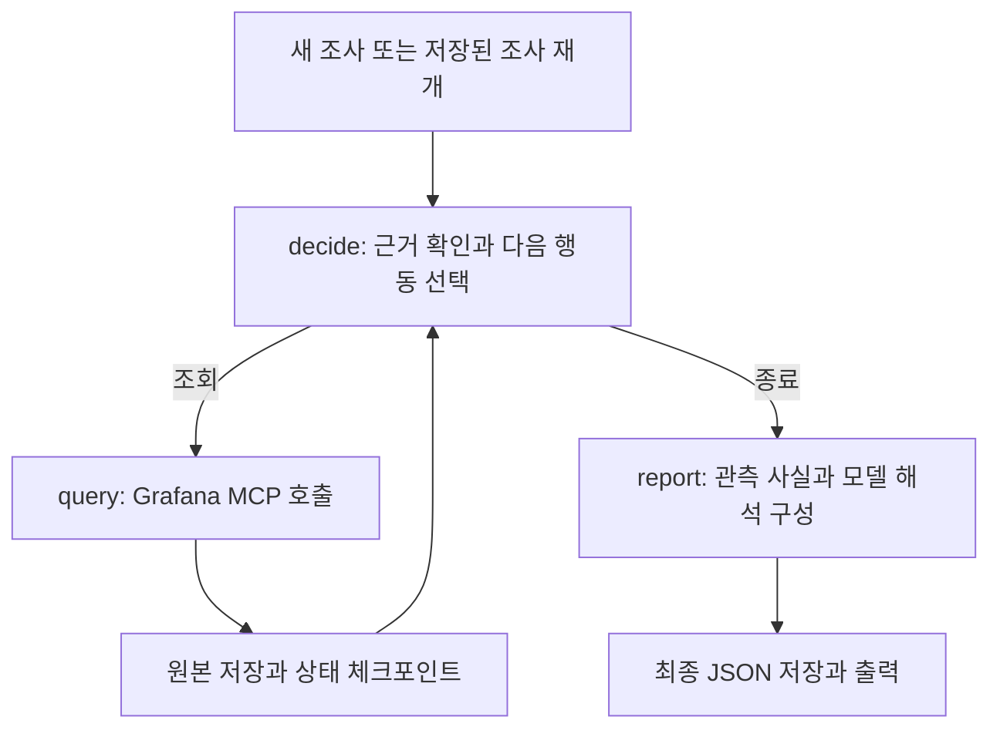

# 조사 구조

[문서 목록](../README.md) · [프로젝트 사용법](../../README.md)

OpsAgent는 Grafana의 읽기 전용 도구로 근거를 수집하고 로컬 모델로 조사 방향을 선택합니다.
LangGraph는 실행 흐름을 관리하고, SQLite 체크포인트는 같은 조사를 중단·재개할 수 있게 합니다.

## 실행 흐름

1. CLI 요청의 대상·시간대·조회 구간을 검증하고 조사 ID와 실행 예산을 설정합니다.
2. 현재 구간의 외부 API 요청률을 수집합니다.
3. 모델이 근거 요약을 보고 다음 조회 또는 종료를 선택합니다.
4. 코드는 허용된 도구, 중복 선택, 출력 형식, 검증 관측 선택과 가설의 근거 ID를 검사합니다.
5. 조회 결과와 상태를 저장하고, 종료 시 최종 보고서를 구성합니다.

모델에는 검증된 요청, 증상, 조회 조건, 근거 요약, 이전 선택과 남은 도구를 전달합니다.
추가 조회가 제공할 정보를 이유로 작성하게 하며, 실제 쿼리는 코드에 정의된 목록에서 실행합니다.
원본 로그 본문은 모델 입력에 포함하지 않습니다.

출력 스키마는 사용 가능한 도구와 `data_available` 근거 ID만 허용합니다. 코드는 다음
두 관측을 계산해 `verified_claims`로 제공하고 모델은 `claim_ids`로 선택합니다.

- 반환 로그의 레벨 요약에 `warn`·`warning`·`error`가 기록됐는지 확인합니다. 문자열 검색
  결과만으로 경고라고 판단하지 않으며, 반환 범위 밖의 로그 존재·부재는 판단하지 않습니다.
- 동일 라벨의 외부 API 요청률에서 직전·현재 구간의 마지막 평가값 증가를 확인합니다.
  고정 쿼리·데이터소스·단위·조회 구간이 일치해야 하고, 중복 라벨·잘못된 값·구간 끝보다
  오래된 마지막 샘플은 비교하지 않습니다. 구간 전체 평균·추세·이상 판정은 아닙니다.

검증 관측이 없으면 `claim_ids`와 가설 목록을 모두 빈 배열로 제한합니다. 가설은 선택한
관측의 근거 ID만 인용할 수 있습니다. 이 제한은 원인 가설의 문장 내용까지 검증하지 않습니다.
`no_data`·`invalid_data` 조회 결과는
한계와 다음 조회 판단을 위해 모델 입력에 남지만 가설 인용에는 사용할 수 없습니다.

형식·도구·근거 검증에 실패하면 실패 응답을 보존하고 같은 판단 안에서 한 번만 수정을
요청합니다. 수정 호출도 기존 시간·모델 호출·토큰 예약·입력 크기 한도를 사용합니다.
수정도 실패하면 `decision_error`로 종료하고 `decision_error.code`에 원인을 기록합니다.
모델 timeout·통신 오류·출력 잘림은 자동 수정 대상이 아닙니다.
프로세스 중단으로 판단 노드가 다시 실행될 수 있으며, 그 경우에도 누적 예산은 유지합니다.
유효한 근거 ID를 인용했다는 사실만으로 가설 내용의 정확성이 보장되지는 않습니다.

## 조회 도구

| 도구 | 조회 내용 |
|---|---|
| `current_metrics` | 요청한 구간의 외부 API별 초당 요청률 |
| `previous_metrics` | 요청 구간과 같은 길이의 직전 구간 요청률 |
| `logs` | 현재 구간의 서비스 로그, 최대 100건 |
| `warning_logs` | `warn` 또는 `error` 문자열에 매칭되는 로그, 최대 100건 |

지표는 5분 rate 계산과 60초 평가 간격을 사용합니다. 조회 구간은 조사 시작 시 고정하며
재개 시에도 유지합니다. 증상 문자열은 이 구간을 변경하지 않습니다.
구간을 생략하면 최근 30분을 사용하며 명시적 구간은 최대 6시간입니다. 이 상한은 초기 실행 제한입니다.
시작·종료는 함께 입력해야 하며 역전·미래 구간은 거부합니다. 오프셋 없는 시각은 지정한
IANA 시간대(기본 `Asia/Seoul`)로 해석합니다. DST로 모호하거나 존재하지 않는 현지 시각은
오프셋을 명시해야 합니다. 확정된 시각은 UTC로 저장합니다.

서비스는 `livith-server`, 조사 유형은 `external_api`, 환경은 `unspecified`만 지원합니다.
현재 쿼리는 환경 라벨로 필터링하지 않으며, 지표에는 서비스 필터도 없습니다.
로그 대상은 `livith-server`입니다. 자연어 증상은 조사 맥락이며 실제 조회 범위를 변경하지 않습니다.

경고 문자열 검색은 실제 로그 레벨 필터와 다릅니다. 두 로그 조회는 결과가 겹칠 수 있고,
빈 조회 결과만으로 서비스가 정상이라고 판단하지 않습니다.

## 실행 제어와 상태 저장

기본 실행 예산은 90초, 도구·모델 호출은 각각 최대 6회입니다. 모델 호출 전에는
17,408 토큰을 예약하며 누적 예약 한도는 110,000입니다. 예약량과 실제 토큰 사용량은
별도로 기록합니다. 도구 호출은 최대 20초, 모델 호출은 최대 45초이며 남은 전체 시간을 적용합니다.
이 값들은 현재 실행 제한이며 분석 품질이나 최대 완료 시간을 보장하는 값은 아닙니다.

예산은 실행 상한이고, 추가 조회 여부는 모델이 선택합니다. 모델이 `finish`를 선택하면
`completed`, 오류나 시간·호출 제한으로 종료되면 `incomplete`와 종료 사유를 기록합니다.
모델의 조사 선택과 해석은 검토 대상입니다. `completed`는 서비스 정상 판정을 뜻하지 않습니다.

| 저장 위치 | 내용 |
|---|---|
| `artifacts/agent/checkpoints.sqlite` | 조사별 상태, 근거 요약, 선택 이력과 다음 실행 위치 |
| `artifacts/agent/<thread_id>/` | 조회 원본, 모델 응답, 예산 장부와 최종 `report.json` |

`--step`은 조회 완료 후 상태를 저장하고 멈춥니다. `--resume`는 같은 ID의 조사를 이어가며
검증된 요청·조회 구간과 소비한 예산을 유지합니다. 중단 시간도 예산에 포함됩니다.
재개·상태 확인 시 새 조사 옵션은 거부합니다. 상태 v3는 요청 정보를 포함하며 v2 상태는
자동 변환하지 않습니다. 이전 조사의 결과 파일은 보존되고 새 조사를 시작해야 합니다.
완료된 조사를 재개하면 저장된 결과를 출력합니다. 조회 도중 중단된 호출은 다시 실행될 수 있습니다.

## 보고서와 실행 추적

Agent 보고서는 파싱된 관측값을 `facts`에 직접 넣고, 모델의 판단·가설·한계·다음 확인 사항을
구분합니다. 가설은 근거 ID를 참조하며, 최소 관측 범위가 부족하면 판단은 `insufficient_evidence`입니다.
근거 ID 검사는 가설의 사실성을 보장하지 않으므로 `semantic_review`는 `pending`으로 기록합니다.
보고서 v3의 `verified_claims` 문장·값은 코드가 구성하며 모델의 원인 가설과 분리합니다.
보고서와 판단 기록에는 `claim_policy_version`을 남깁니다. 보고서와 실행 기록에는
적용한 기본값·시간대를 포함한 요청을 저장합니다.
Agent 프롬프트는 `ops_agent_v4`이며 기존 버전 파일은 보존합니다. 재개 시에는 저장된
프롬프트와 버전을 사용하지만, 재개 후 판단 검사는 현재 코드의 관측 정책을 적용합니다.
이미 완료된 보고서는 다시 검증하지 않습니다. 버전 필드가 없는 기존 상태 v3는 당시의 `ops_agent_v2`로 기록합니다.

`tools/grafana.py`는 Livith의 운영 데이터를 조회하고, `telemetry/langfuse.py`는 OpsAgent
자신의 실행을 추적합니다. Langfuse를 켜면 실행·재개별 `ops-agent` trace에 도구 호출과
`ollama-planner`가 연결됩니다. 자세한 전송 범위는 [설정 안내](../setup/langfuse.md)를 참고하세요.
각 모델 응답은 판단 ID·시도 번호·수정 대상 ID·검증 결과를 별도로 저장하고 추적합니다.
수정 성공 후에도 첫 실패 응답은 남습니다.

## 고정 보고서와의 관계

`run_investigation.py`는 지표 → 로그 → 보고서의 고정 순서로 실행합니다.
Agent와 수집·파싱·추적 코드를 공유하며, 보고서 형식과 생성 경로는 다릅니다.
고정 보고서 v3는 모델이 반환한 관측값을 원본 요약과 대조합니다.
`evaluate_reports.py`는 이 고정 보고서를 대상으로 평가합니다.
